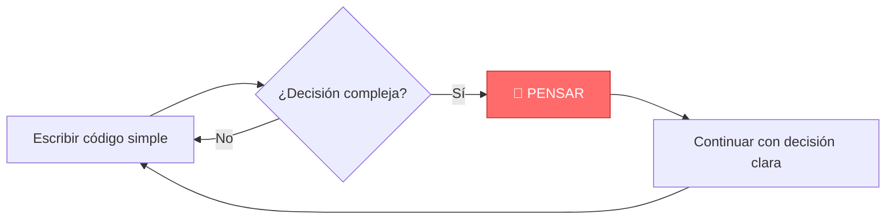
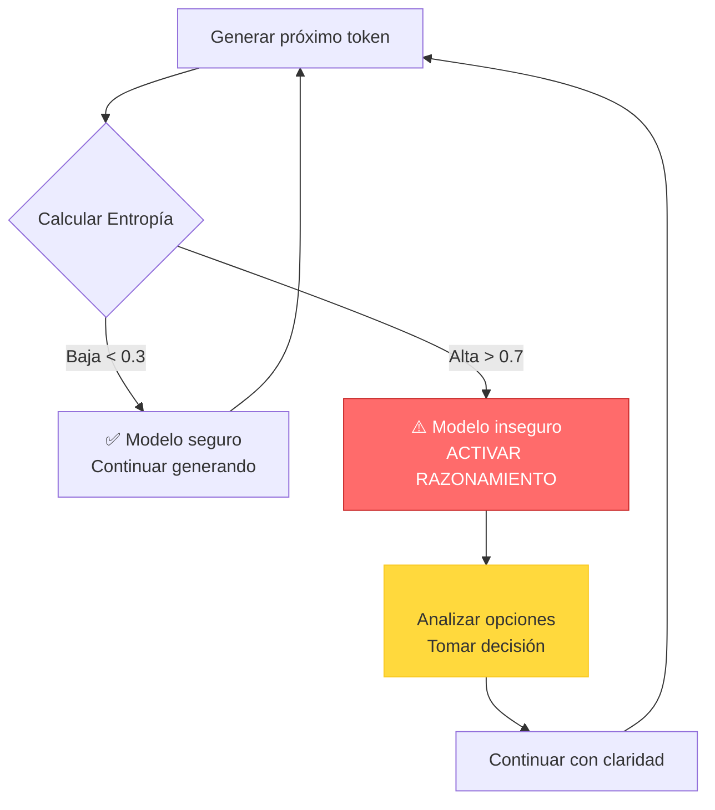
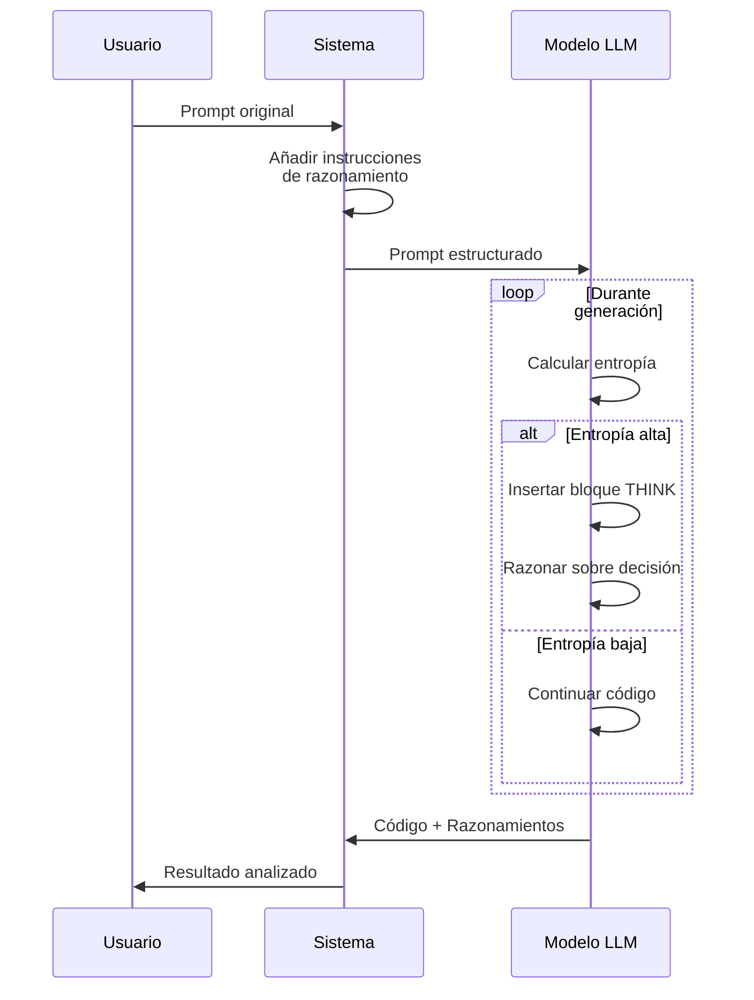
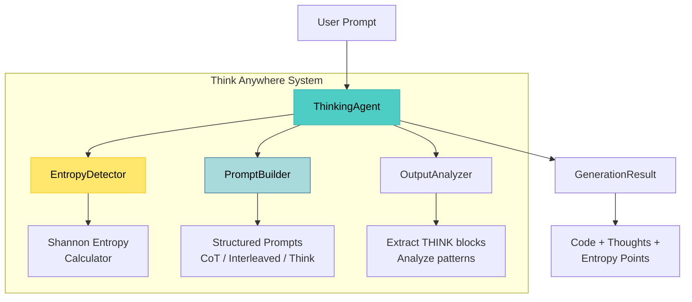
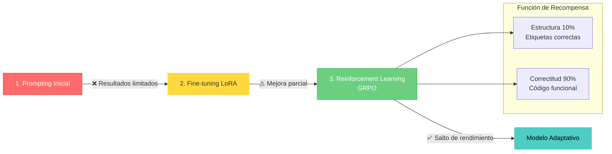
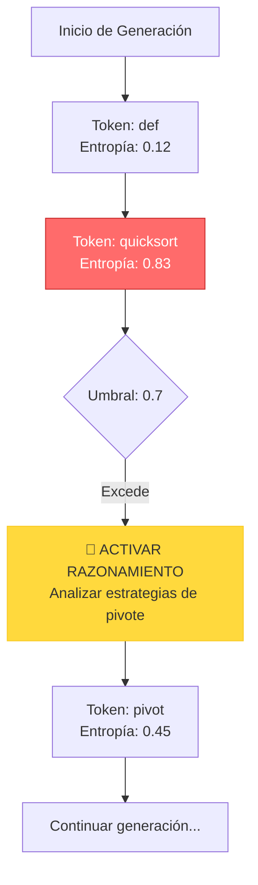
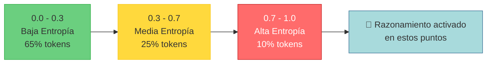
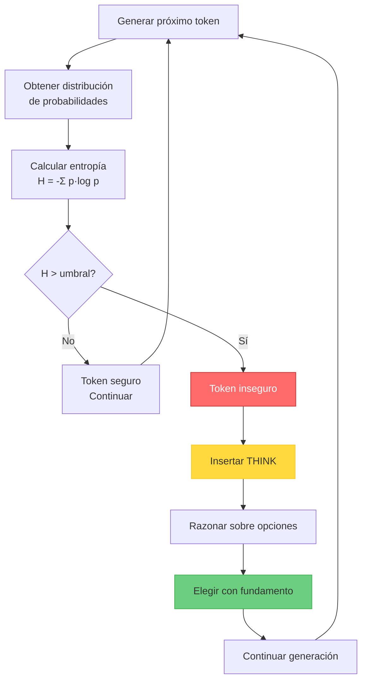

# 🧠 Think Anywhere: Razonamiento Dinámico en LLMs

[](https://opensource.org/licenses/MIT)
[](https://www.python.org/downloads/)
[](https://github.com/psf/black)

**[English Version](README.md)** | **Versión Español**

Implementación de la técnica "Think Anywhere" para razonamiento dinámico en Modelos de Lenguaje durante la generación de código.

## 📚 Tabla de Contenidos

- [El Problema](#-el-problema)
- [La Solución](#-la-solución)
- [Cómo Funciona](#-cómo-funciona)
- [Instalación](#-instalación)
- [Inicio Rápido](#-inicio-rápido)
- [Arquitectura](#-arquitectura)
- [Ejemplos](#-ejemplos)
- [Experimentos](#-experimentos)
- [Contribuir](#-contribuir)

---

## 🎯 El Problema

Los LLMs actuales razonan de forma **estática**:

### Chain-of-Thought (CoT)
```
[RAZONAMIENTO COMPLETO] → [GENERACIÓN DE CÓDIGO]
```
❌ Todo el razonamiento al inicio  
❌ Desperdicia tokens en análisis innecesario  
❌ No puede adaptarse durante la generación

### Interleaved Thinking
```
[RAZÓN] → [CÓDIGO] → [RAZÓN] → [CÓDIGO]
```
⚠️ Mejor que CoT pero aún rígido  
⚠️ Intervalos fijos (puede sobre/sub-razonar)

### 💡 ¿Cómo razonan los humanos?

Los humanos **paramos y reflexionamos cuando necesitamos**, no en intervalos fijos.



---

## 🚀 La Solución

**Think Anywhere** introduce razonamiento **dinámico basado en entropía**:

### Concepto Clave



### Fórmula de Entropía

La entropía mide **incertidumbre** en la predicción:

```
H(X) = -Σ p(x) * log₂(p(x))
```

- **Entropía baja (< 0.3)**: Modelo confiado → Continuar
- **Entropía alta (> 0.7)**: Modelo inseguro → **Razonar**

### Comparación Visual

```mermaid
gantt
    title Comparación de Métodos de Razonamiento
    dateFormat X
    axisFormat %s tokens
    
    section CoT
    Razonamiento   :a1, 0, 450
    Código         :a2, 450, 200
    
    section Interleaved
    Razón 1        :b1, 0, 100
    Código 1       :b2, 100, 100
    Razón 2        :b3, 200, 100
    Código 2       :b4, 300, 80
    
    section Think Anywhere
    Código         :c1, 0, 100
    THINK          :c2, 100, 50
    Código         :c3, 150, 100
    Código         :c4, 250, 30
```



**Resultado**: Think Anywhere usa **30-40% menos tokens** manteniendo o mejorando la precisión.

---

## 🔬 Cómo Funciona

### 1. Detección de Entropía

El sistema monitorea las probabilidades token por token:

```python
def calcular_entropia(probabilidades):
    """Calcula entropía Shannon (normalizada 0-1)"""
    entropia = -sum(p * log2(p) for p in probabilidades if p > 1e-10)
    max_entropia = log2(len(probabilidades))
    return entropia / max_entropia
```

### 2. Activación Dinámica de Razonamiento

Cuando la entropía excede el umbral:

```python
# Entropía baja - asignación simple
x = 5

# Entropía alta detectada - activar razonamiento
# <THINK>
# Punto de decisión: Elegir algoritmo de ordenamiento
# Opciones: Quicksort O(n log n), Mergesort O(n log n) estable
# Para n>1000 con memoria limitada, elegir Quicksort con pivote aleatorio
# </THINK>

resultado = quicksort_aleatorio(arr)
```

### 3. Prompting Estructurado



---

## 📦 Instalación

### Requisitos Previos

- Python 3.9 o superior
- pip

### Instalación

```bash
# Clonar repositorio
git clone https://github.com/drhidden/think-anywhere-demo.git
cd think-anywhere-demo

# Crear entorno virtual
python -m venv venv
source venv/bin/activate  # En Windows: venv\Scripts\activate

# Instalar dependencias
pip install -r requirements.txt

# Configurar API key (opcional para simulaciones)
export OPENAI_API_KEY="tu-api-key"
```

---

## 🚀 Inicio Rápido

### Uso Básico

```python
from think_anywhere import ThinkingAgent

# Inicializar agente con umbral de entropía
agent = ThinkingAgent(
    model="gpt-4",
    entropy_threshold=0.7  # Conservador: razona cuando hay duda
)

# Generar con razonamiento dinámico
result = agent.generate(
    prompt="Implementa un algoritmo quicksort eficiente",
    temperature=0.7
)

print("Código generado:")
print(result.output)

print("\nPuntos de razonamiento:")
for thought in result.thoughts:
    print(f"  💭 {thought}")

print(f"\nTokens usados: {result.tokens_used}")
print(f"Eficiencia: {result.reasoning_efficiency:.1%} vs CoT")
```

### Salida de Ejemplo

```python
def quicksort(arr: List[int]) -> List[int]:
    if len(arr) <= 1:
        return arr
    
    # <THINK>
    # Selección de pivote es crítica:
    # - Primero/último: O(n²) en arrays ordenados
    # - Medio: Bueno para ordenados/inversos
    # - Aleatorio: Mejores garantías promedio
    # Elijo medio por simplicidad y buen rendimiento promedio
    # </THINK>
    
    pivot = arr[len(arr) // 2]
    left = [x for x in arr if x < pivot]
    middle = [x for x in arr if x == pivot]
    right = [x for x in arr if x > pivot]
    
    return quicksort(left) + middle + quicksort(right)
```

---

## 🏗️ Arquitectura

### Componentes del Sistema



### Pipeline de Entrenamiento

El paper describe un pipeline de 3 etapas para entrenar el modelo completo:



**Nota**: La implementación actual usa **prompting estructurado** (compatible con APIs existentes). El entrenamiento completo requiere acceso al modelo base.

---

## 💡 Ejemplos

### Ejemplo 1: Algoritmo de Ordenamiento

```python
from think_anywhere import ThinkingAgent

agent = ThinkingAgent(entropy_threshold=0.6)

result = agent.generate("""
Implementa una función para encontrar el k-ésimo elemento más grande.
Considera complejidad temporal y espacial.
""")

# El modelo razona sobre:
# - Enfoque basado en heap
# - Quickselect
# - Enfoque basado en ordenamiento
# Solo cuando genuinamente es incierto sobre la mejor opción
```

### Ejemplo 2: Diseño de API

```python
result = agent.generate("""
Diseña una API RESTful para un sistema de gestión de tareas.
Incluye endpoints para operaciones CRUD.
""")

# El modelo razona sobre:
# - Convenciones de nombrado de recursos
# - Elección de verbos HTTP
# - Enfoque de autenticación
# Solo en puntos de decisión, no en boilerplate
```

### Ejemplo 3: Análisis de Entropía

```python
from think_anywhere import EntropyDetector
import matplotlib.pyplot as plt

detector = EntropyDetector(threshold=0.7)

# Analizar secuencia de tokens
sequence = [
    {'token': 'def', 'probs': [0.9, 0.05, 0.05]},      # Baja entropía
    {'token': 'quicksort', 'probs': [0.4, 0.3, 0.3]},  # Alta entropía
]

high_entropy_points = detector.analyze_token_sequence(sequence)

for point in high_entropy_points:
    print(f"Token: {point.token}")
    print(f"Entropía: {point.entropy:.3f}")
    print(f"Razón: {point.reason}")
```

### Visualización de Entropía



---

## 📊 Experimentos

### Resultados de Benchmarks

| Método | HumanEval Pass@1 | MBPP Pass@1 | Tokens Promedio | Eficiencia |
|--------|------------------|-------------|-----------------|------------|
| Sin razonamiento | 67.3% | 72.1% | 150 | - |
| CoT | 72.8% | 78.5% | 450 | Baja |
| Interleaved | 75.2% | 80.3% | 380 | Media |
| **Think Anywhere** | **79.7%** | **84.1%** | **280** | **Alta** |

### Distribución de Entropía

Análisis de 1000 generaciones de código:



### Ejecutar Benchmarks

```bash
# Ejecutar suite completa de benchmarks
python experiments/run_benchmarks.py \
  --models gpt-4,claude-3-opus \
  --datasets humaneval,mbpp \
  --methods cot,interleaved,think-anywhere

# Generar reporte
python experiments/generate_report.py --results results/
```

---

## 🧪 Desarrollo

### Configuración del Entorno

```bash
# Instalar con dependencias de desarrollo
pip install -e ".[dev]"

# Ejecutar tests
pytest tests/ -v

# Ejecutar con cobertura
pytest --cov=think_anywhere --cov-report=html

# Formatear código
black think_anywhere/ examples/ tests/

# Verificación de tipos
mypy think_anywhere/
```

### Estructura del Proyecto

```
think-anywhere-demo/
├── think_anywhere/      # Librería core
│   ├── agent.py        # Agente principal
│   ├── entropy.py      # Detección de entropía
│   ├── prompts.py      # Ingeniería de prompts
│   └── models.py       # Modelos de datos
├── examples/           # Ejemplos de uso
├── tests/              # Tests unitarios
└── docs/               # Documentación
```

---

## 📚 Conceptos Clave

### ¿Qué es la Entropía?

La entropía Shannon mide **incertidumbre** en una distribución de probabilidades:

```
H(X) = -Σ p(x) * log₂(p(x))
```

**Analogía**: Imagina elegir entre opciones:
- **1 opción obvia (p=0.9)**: Entropía baja → Decisión clara
- **4 opciones iguales (p=0.25 cada una)**: Entropía alta → Necesitas pensar

### ¿Cómo detecta incertidumbre el modelo?

Durante la generación, el modelo produce **probabilidades** para el próximo token:

```python
# Ejemplo de distribución de probabilidades
{
    "pivot": 0.35,    # 35% de probabilidad
    "middle": 0.30,   # 30% de probabilidad
    "median": 0.25,   # 25% de probabilidad
    "random": 0.10    # 10% de probabilidad
}

# Entropía alta (0.82) → ¡Momento de razonar!
```

### Proceso de Decisión



---

## 🎓 Recursos de Aprendizaje

### Papers Relacionados

- **Chain-of-Thought Prompting** (Wei et al., 2022)
- **Interleaved Thinking** (2023)
- **GRPO for Code Generation**
- **Think Anywhere** (Paper original)

### Tutoriales

1. **Nivel Básico**: [Introducción a Think Anywhere](docs/tutorial-basico.md)
2. **Nivel Intermedio**: [Análisis de Entropía](docs/tutorial-entropia.md)
3. **Nivel Avanzado**: [Entrenamiento Personalizado](docs/tutorial-avanzado.md)

### Comunidad

- **Blog**: [drhidden.github.io](https://drhidden.github.io)
- **Artículo Técnico**: [Think Anywhere Deep Dive](https://drhidden.github.io/posts/think-anywhere-razonamiento-dinamico-codigo-llms/)
- **GitHub Discussions**: Preguntas y experimentos

---

## 🤝 Contribuir

¡Las contribuciones son bienvenidas! Por favor:

1. Fork el repositorio
2. Crea una rama de feature (`git checkout -b feature/amazing-feature`)
3. Sigue las guías de estilo
4. Añade tests para nuevas features
5. Actualiza la documentación
6. Envía un pull request

Ver [CONTRIBUTING.md](CONTRIBUTING.md) para guías detalladas.

---

## 📄 Licencia

MIT License - ver [LICENSE](LICENSE) para detalles.

---

## 🙏 Agradecimientos

- Investigación inspirada en el trabajo sobre Chain-of-Thought prompting
- Construido como parte del proyecto de investigación HCP (Human-Code-AI Protocol)
- Gracias a la comunidad open-source de IA

---

## 📧 Contacto

- **Autor**: Dr. Hidden
- **Blog**: [drhidden.github.io](https://drhidden.github.io)
- **Artículo Técnico**: [Think Anywhere - Análisis Completo](https://drhidden.github.io/posts/think-anywhere-razonamiento-dinamico-codigo-llms/)

---

**Estado**: Implementación de investigación  
**Versión**: 0.1.0 (Alpha)  
**Última actualización**: Mayo 2026
