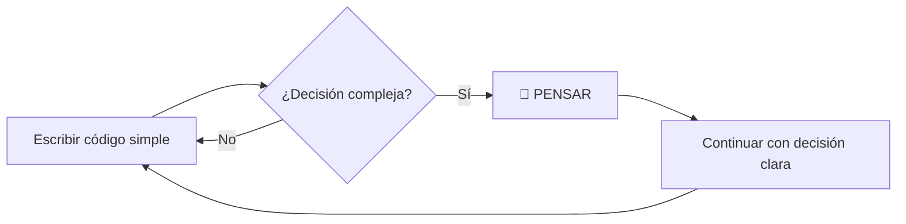
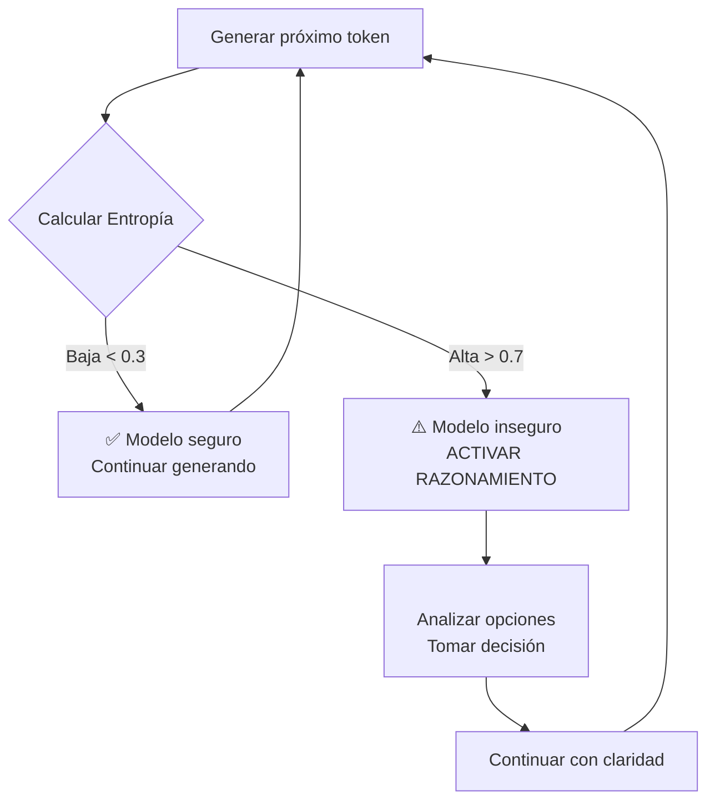
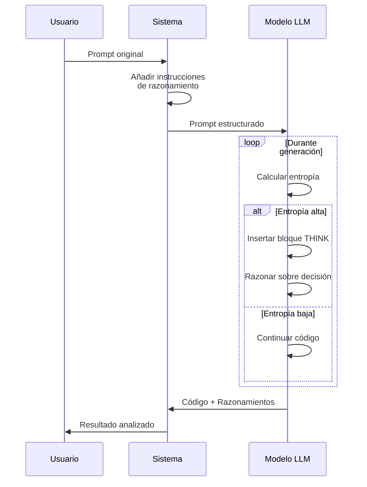
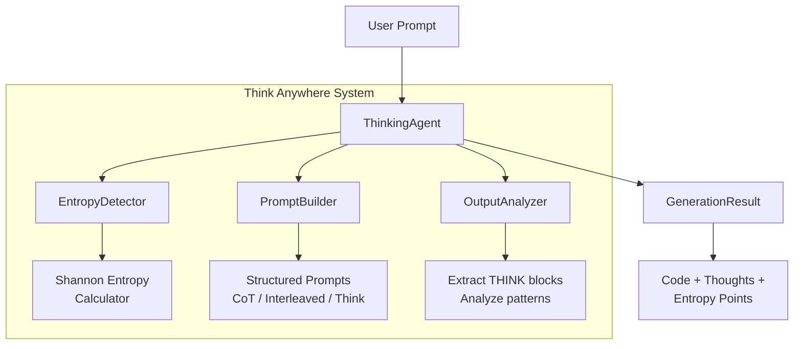
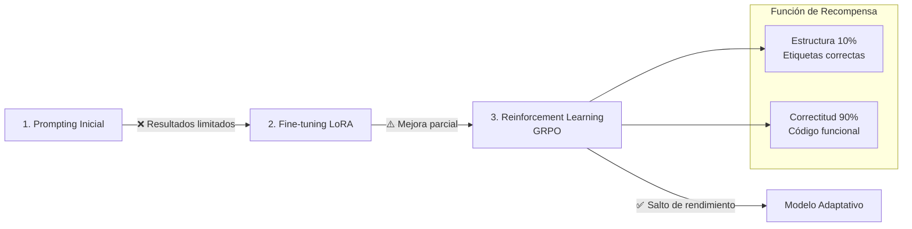
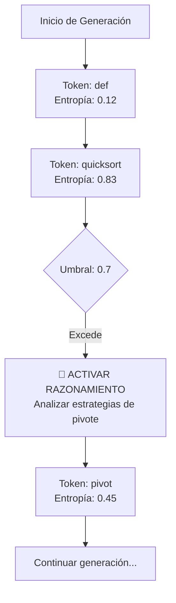
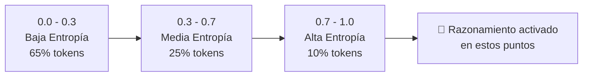
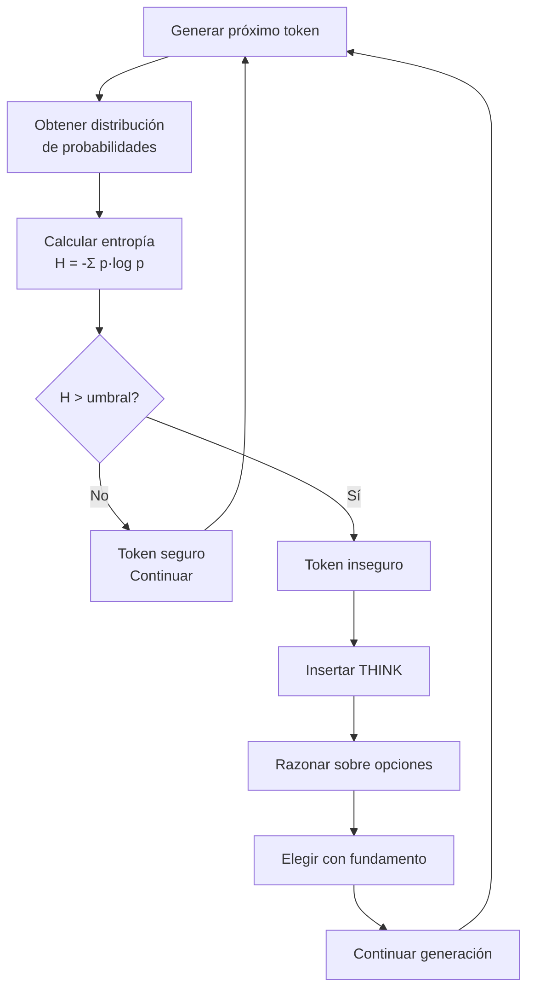

# 📊 Guía Visual: Think Anywhere Diagrams

Este documento explica todos los diagramas educativos incluidos en los READMEs del proyecto Think Anywhere.

## 📚 Diagrama 1: Flujo de Razonamiento Humano

**Ubicación**: Sección "El Problema" / "The Problem"  
**Tipo**: Diagrama de flujo (Mermaid)

**Propósito Educativo**:
- Muestra cómo los humanos razonamos **dinámicamente**
- Contrasta con el razonamiento estático de los LLMs tradicionales
- Introduce la necesidad de Think Anywhere

---

## 📊 Diagrama 2: Concepto Core - Detección de Entropía

**Ubicación**: Sección "La Solución" / "The Solution"  
**Tipo**: Diagrama de flujo con colores (Mermaid)

**Propósito Educativo**:
- Explica **el concepto central** de Think Anywhere
- Muestra cómo la **entropía** actúa como trigger
- Códigos de color:
  - 🟢 Verde: Flujo normal (baja entropía)
  - 🔴 Rojo: Alerta de alta entropía
  - 🟡 Amarillo: Bloque de razonamiento

---

## 📈 Diagrama 3: Comparación de Métodos (Gantt)

**Ubicación**: Sección "La Solución" / "The Solution"  
**Tipo**: Gantt Chart (Mermaid)

```mermaid
gantt
    title Comparación de Métodos de Razonamiento
    dateFormat X
    axisFormat %s tokens
    
    section CoT
    Razonamiento   :a1, 0, 450
    Código         :a2, 450, 200
    
    section Interleaved
    Razón 1        :b1, 0, 100
    Código 1       :b2, 100, 100
    Razón 2        :b3, 200, 100
    Código 2       :b4, 300, 80
    
    section Think Anywhere
    Código         :c1, 0, 100
    THINK          :c2, 100, 50
    Código         :c3, 150, 100
    Código         :c4, 250, 30
```

**Propósito Educativo**:
- **Comparación visual directa** de uso de tokens
- Muestra que Think Anywhere:
  - Usa menos tokens totales
  - Razona solo cuando es necesario
  - Es más eficiente que CoT e Interleaved

**Datos clave**:
- CoT: ~650 tokens (más razonamiento inicial)
- Interleaved: ~480 tokens (razonamiento fijo)
- Think Anywhere: ~280 tokens (razonamiento adaptativo)

---

## 🔄 Diagrama 4: Secuencia del Sistema

**Ubicación**: Sección "Cómo Funciona" / "How It Works"  
**Tipo**: Diagrama de secuencia (Mermaid)

**Propósito Educativo**:
- Muestra la **interacción entre componentes**
- Explica el flujo de datos desde el usuario al resultado
- Detalla el **loop de generación** con decisiones de entropía

---

## 🏗️ Diagrama 5: Arquitectura del Sistema

**Ubicación**: Sección "Arquitectura" / "Architecture"  
**Tipo**: Diagrama de grafo (Mermaid)

**Propósito Educativo**:
- Muestra la **estructura modular** del código
- Identifica componentes principales:
  - **ThinkingAgent**: Coordinador principal
  - **EntropyDetector**: Calcula incertidumbre
  - **PromptBuilder**: Construye prompts estructurados
  - **OutputAnalyzer**: Extrae razonamientos
- Facilita entender el código fuente

---

## 🧪 Diagrama 6: Pipeline de Entrenamiento

**Ubicación**: Sección "Arquitectura" / "Architecture"  
**Tipo**: Diagrama de flujo con subgrafos (Mermaid)

**Propósito Educativo**:
- Explica **cómo se entrenaría** el modelo completo
- Muestra progresión: Prompting → LoRA → RL
- Detalla la **función de recompensa**:
  - 10% estructura (etiquetas correctas)
  - 90% correctitud (código funcional)

**Nota importante**: La implementación actual usa solo prompting (paso 1). El entrenamiento completo requiere acceso al modelo base.

---

## 📊 Diagrama 7: Análisis de Secuencia de Tokens

**Ubicación**: Sección "Ejemplos" / "Examples"  
**Tipo**: Diagrama de flujo temporal (Mermaid)

**Propósito Educativo**:
- Muestra un **caso real** de detección de entropía
- Valores concretos de entropía:
  - `def`: 0.12 (muy seguro, keyword obvio)
  - `quicksort`: 0.83 (¡alta entropía! necesita pensar)
  - `pivot`: 0.45 (después de razonar, más claridad)
- Demuestra que el razonamiento **reduce la entropía posterior**

---

## 📉 Diagrama 8: Distribución de Entropía

**Ubicación**: Sección "Experimentos" / "Experiments"  
**Tipo**: Diagrama de flujo lineal (Mermaid)

**Propósito Educativo**:
- Muestra **distribución empírica** de entropía
- Datos de análisis de 1000 generaciones:
  - 65% tokens: Baja entropía (generación fluida)
  - 25% tokens: Media entropía (cierta duda)
  - 10% tokens: Alta entropía (razonamiento necesario)
- Justifica por qué Think Anywhere es **eficiente**: solo razona en ~10% de casos

---

## 🧠 Diagrama 9: Proceso de Decisión Detallado

**Ubicación**: Sección "Conceptos Clave" / "Key Concepts"  
**Tipo**: Diagrama de flujo completo (Mermaid)

**Propósito Educativo**:
- Explica el **algoritmo completo** paso a paso
- Muestra claramente la **bifurcación de decisión**
- Incluye la fórmula de entropía: `H = -Σ p·log p`
- Demuestra el **ciclo de feedback**: después de razonar, la generación continúa con más confianza

---

## 🎯 Resumen de Beneficios Educativos

### 1. **Progresión Didáctica**

Los diagramas están ordenados para construir conocimiento:

1. **Problema** → Muestra limitaciones actuales
2. **Solución** → Introduce concepto de entropía
3. **Comparación** → Visualiza ventajas cuantitativas
4. **Implementación** → Explica cómo funciona internamente
5. **Arquitectura** → Estructura del código
6. **Ejemplos** → Casos reales con datos
7. **Conceptos** → Profundización teórica

### 2. **Múltiples Estilos Visuales**

- **Diagramas de flujo**: Para procesos y decisiones
- **Gantt charts**: Para comparaciones temporales
- **Diagramas de secuencia**: Para interacciones
- **Grafos**: Para arquitectura
- **Flowcharts**: Para algoritmos detallados

### 3. **Códigos de Color Consistentes**

- 🔴 **Rojo**: Alerta, alta entropía, necesita atención
- 🟡 **Amarillo**: Razonamiento, bloques THINK
- 🟢 **Verde**: Flujo normal, baja entropía
- 🔵 **Azul/Cyan**: Componentes del sistema

### 4. **Datos Cuantitativos**

Todos los diagramas incluyen:
- Valores de entropía específicos (0.12, 0.83, etc.)
- Porcentajes de uso de tokens (30-40% reducción)
- Distribuciones estadísticas (65%, 25%, 10%)
- Resultados de benchmarks (HumanEval, MBPP)

---

## 🚀 Cómo Usar Esta Guía

### Para Estudiantes

1. **Lectura secuencial**: Sigue los diagramas en orden
2. **Experimentación**: Ejecuta ejemplos del código mientras estudias
3. **Comparación**: Usa los diagramas de comparación para entender trade-offs

### Para Desarrolladores

1. **Arquitectura primero**: Empieza por el diagrama de arquitectura
2. **Implementación**: Usa el diagrama de proceso de decisión como guía
3. **Optimización**: Consulta la distribución de entropía para ajustar thresholds

### Para Investigadores

1. **Pipeline de entrenamiento**: Referencia para reproducir resultados
2. **Análisis estadístico**: Usa distribuciones para validar hipótesis
3. **Comparación de métodos**: Gantt chart para papers comparativos

---

## 📝 Notas Técnicas

### Renderizado de Diagramas

- **GitHub**: Renderiza Mermaid automáticamente
- **Local**: Usa extensiones de Markdown:
  - VSCode: "Markdown Preview Mermaid Support"
  - Jupyter: `!pip install mermaid`
- **Documentación**: Sphinx con `sphinxcontrib-mermaid`

### Editando Diagramas

Todos los diagramas están en formato **Mermaid**, que es:
- ✅ Basado en texto (fácil de versionar)
- ✅ Renderizado automático en GitHub
- ✅ Editable sin herramientas gráficas
- ✅ Exportable a SVG/PNG

**Editor online**: https://mermaid.live/

---

## 🎓 Recursos Adicionales

Para profundizar en los conceptos visualizados:

1. **Entropía Shannon**: [Wikipedia - Shannon Entropy](https://en.wikipedia.org/wiki/Entropy_(information_theory))
2. **Chain-of-Thought**: Paper original (Wei et al., 2022)
3. **Mermaid Syntax**: [Documentación oficial](https://mermaid.js.org/)
4. **Blog del autor**: [drhidden.github.io](https://drhidden.github.io)

---

**Última actualización**: Mayo 2026  
**Versión**: 1.0  
**Autor**: Dr. Hidden
